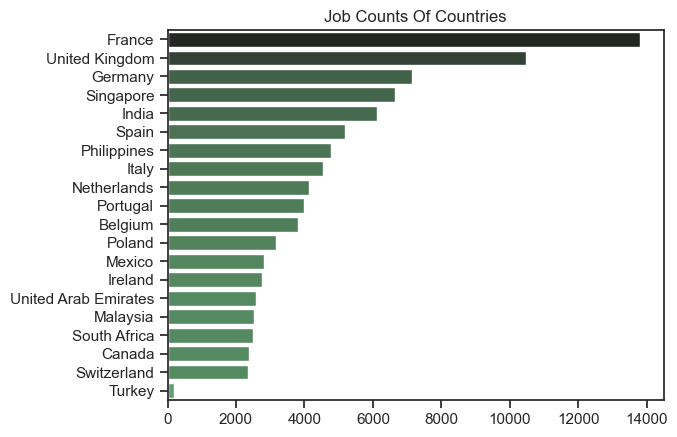
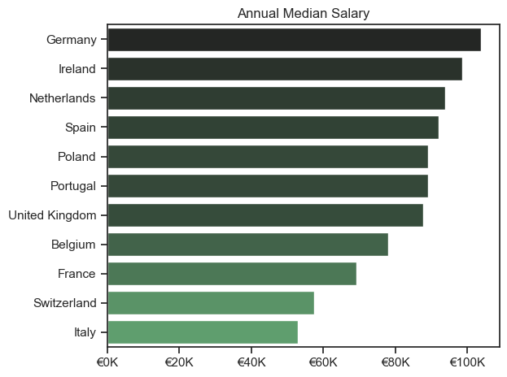
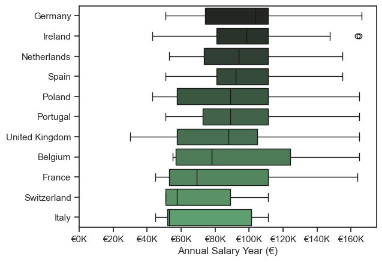
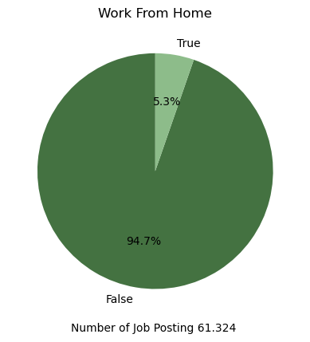
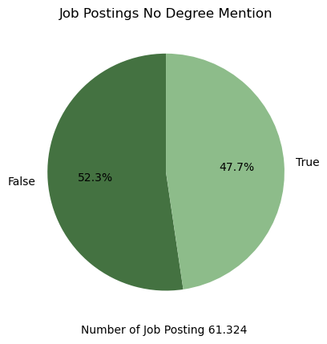
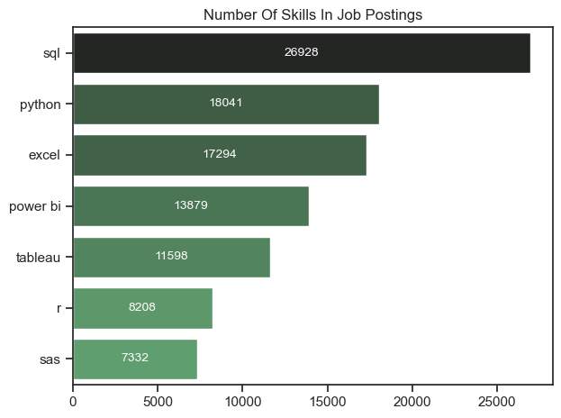
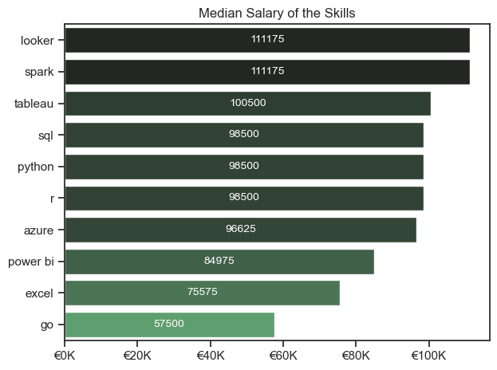
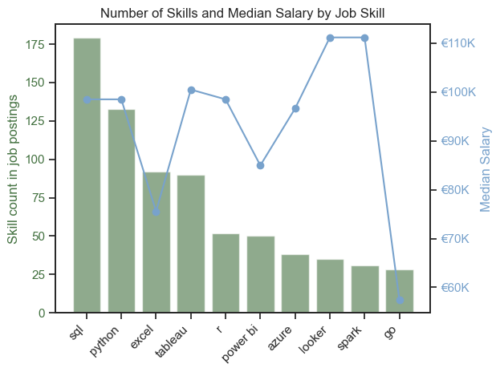
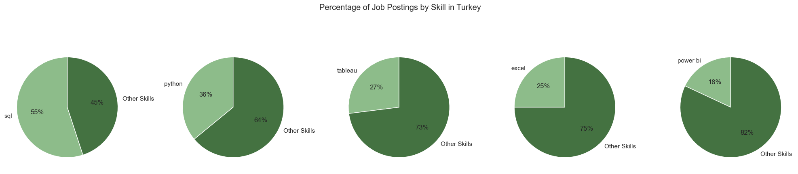

# Overview
Welcome to my analysis of the data job market, with a focus on data analyst roles with the countries which are in Europe and highest job postings.

# The Questions

1. Which countries have the highest job postings except US ? 
2. What is the highest median salary in EU ? 
3. What is the percentage of remote work ? 
4. What is the percentage of the job postings that require degree ? 
5. What are the most demanded and highest paid skills ? 

# Tools I Used

For my deep dive into the data analyst job market, I harnessed the power of several key tools:

- **Python:** The backbone of my analysis, allowing me to analyze the data and find critical insights.I also used the following Python libraries:
    - **Pandas Library:** This was used to analyze the data.
    - **Matplotlib Library:** I visualized the data.
    - **Seaborn Library:** Helped me create more advanced visuals.
- **Jupyter Notebooks**: The tool I used to run my Python scripts which let me easily include my notes and analysis.
- **Visual Studio Code:** My go-to for executing my Python scripts.
- **Git & GitHub:** Essential for version control and sharing my Python code and analysis, ensuring collaboration and project tracking.

# Data Preparation and Cleanup

This section outlines the steps taken to prepare the data for analysis, ensuring accuracy and usability.

### Import & Clean Up Data

I start by importing necessary libraries and loading the dataset, followed by initial data cleaning tasks to ensure data quality.

```python
# Importing Libraries
import ast
import pandas as pd
import seaborn as sns
from datasets import load_dataset
import matplotlib.pyplot as plt  

# Loading Data
dataset = load_dataset('lukebarousse/data_jobs')
df = dataset['train'].to_pandas()

# Data Cleanup
df['job_posted_date'] = pd.to_datetime(df['job_posted_date'])
df['job_skills'] = df['job_skills'].apply(lambda x: ast.literal_eval(x) if pd.notna(x) else x)
```

## Filter EU Data Analyst Jobs and Add Turkey

To focus my analysis on the EU + Turkey Data Analyst job market, I apply filters to the dataset.

```python
df_DA = df[df['job_title_short'] == 'Data Analyst'].copy()
df_DA_country = df_DA['job_country'].value_counts().to_frame().head(20)
df_DA_country = df_DA_country[1:20]
df_DA_TR = df_DA[df_DA['job_country'] == 'Turkey'].value_counts('job_country').to_frame()
df_DA_country = pd.concat([df_DA_country, df_DA_TR])
```

# The Analysis

## 1. Which countries have the highest job postings except US ? 

View my notebook with detailed steps here:
[1_Salary_Details_NotUS.ipynb]()

```python
# Create a graph with seaborn
sns.set_theme(style='ticks')
sns.barplot(data=df_DA_country, x='count', y='job_country', hue='count', palette='dark:g_r', legend=False)
plt.title('Job Counts Of Countries')
plt.xlabel('')
plt.ylabel('')
plt.show()
```



*Bar graph visualizing the number of job postings.*

### Insights

- France, United Kingdom and Germany have the highest numbers.
- Singapore, India and Philippines have solid numbers, which are close to EU zone.
- Turkey has small number of job posting compared the top 20.

## 2. What is the highest median salary in EU ? 

You can view the detailed steps in my notebook here: [1_Salary_Details_NotUS.ipynb]().


```python
# Get the country names for further analysis
list_of_countries = df_DA_country.index.to_list()

# Because of the currency deficit, need to remove some of the countries 
list_to_remove = ['Singapore', 'India', 'Philippines', 'Turkey','Mexico', 'United Arab Emirates', 'Malaysia', 'South Africa', 'Canada']
for i in range(len(list_to_remove)):
    list_of_countries.remove(list_to_remove[i])

# Drop the values that have Nan values in salary_year_avg
df_DA_selected = df_DA_country.dropna(subset='salary_year_avg')

df_DA_selected_salary = df_DA_selected.groupby('job_country')['salary_year_avg'].agg(['count', 'median']).sort_values(by='median', ascending=False)

#Create graph with seaborn
sns.set_theme(style='ticks')
sns.barplot(data=df_DA_selected_salary, x='median', y='job_country', hue='median', palette='dark:g_r')
plt.title('Annual Median Salary')
plt.ylabel('')
plt.xlabel('')
plt.legend().remove()

ax = plt.gca()
ax.xaxis.set_major_formatter(plt.FuncFormatter(lambda x, pos: f'€{int(x/1000)}K'))

plt.tight_layout()

list_of_countries
```





### Insights

- Germany has the highest median salary in EU zone.
- Majority of the countries have more than €80K / year median salary.
- The top 6 countries mainly offer annual salaries between €80K and €110K.

### Unfortunately Turkey don't have enough data to analyze. 
-| job_title                 | company_name      | salary_year_avg | job_posted_date       |
-|---------------------------|-------------------|-----------------|-----------------------|
-| Data Warehouse Analyst     | Robert Half       | 110000.0        | 2023-02-02 13:16:23    |
-| Data Architect             | Libertex Group    | 163782.0        | 2023-06-07 08:48:08    |
-| Data Analyst               | Ace Games         | 57500.0         | 2023-07-05 16:30:39    |
-| Product Data Analyst       | Fugo Games        | 57600.0         | 2023-11-17 19:22:56    |
-| Product Data Analyst       | Fugo Games        | 50400.0         | 2023-04-06 04:23:55    |

## 3. What is the percentage of remote work ?

You can view the detailed steps in my notebook here: [2_Remote_Degree_NotUS.ipynb]().

```python
# Listed the job counts based on country name
df_DA_country = df_DA['job_country'].value_counts().to_frame().head(20)
df_DA_country = df_DA_country[1:20]
list_of_countries = df_DA_country.index.to_list()

# Because of the currency deficit, need to remove some of the countries 
list_to_remove = ['Singapore', 'India', 'Philippines','Mexico', 'United Arab Emirates', 'Malaysia', 'South Africa', 'Canada']
for i in range(len(list_to_remove)):
    list_of_countries.remove(list_to_remove[i])

df_DA_country = df_DA[df_DA['job_country'].isin(list_of_countries)]
#df_DA_country.value_counts('job_title_short') there are 61324 job postings
# list_of_countries countries that we work on: ['France','United Kingdom','Germany' 'Spain','Italy','Netherlands','Portugal','Belgium','Poland 'Ireland','Switzerland']

df_DA_country['job_work_from_home'].value_counts().plot(kind='pie',startangle=90, autopct='%1.1f%%', colors=['#447241', '#8dbc8a'])
plt.title('Work From Home')
plt.ylabel('')
plt.xlabel('Number of Job Posting 61.324 ')
plt.show()
```



*EU zone don't like work from home :)*

## 4. What is the percentage of the job postings that require degree ?
You can view the detailed steps in my notebook here: [2_Remote_Degree_NotUS.ipynb]().

```python
df_DA_country['job_no_degree_mention'].value_counts().plot(kind='pie',startangle=90, autopct='%1.1f%%', colors=['#447241', '#8dbc8a'])
plt.title('Job Postings No Degree Mention')
plt.ylabel('')
plt.xlabel('Number of Job Posting 61.324 ')
plt.show()
```


*Almost half of the jobs postings in EU doesn't require degree.*

## 5. What are the most demanded and highest paid skills ? 

You can view the detailed steps in my notebook here: [3_Optimal_Skills_NotUS.ipynb]().

```python
#df_DA_EU_exploded.shape[0]  -  192.230 job postings
#df_DA_EU_exploded.dropna(subset='job_skills').shape[0]  -  179.794 job postings
df_DA_EU_exploded_plot =  df_DA_EU_exploded['job_skills'].value_counts().to_frame().head(7)

sns.set_theme(style='ticks')
plt.title('Number Of Skills In Job Postings')

ax = sns.barplot(data=df_DA_EU_exploded_plot, x='count', y='job_skills', hue='count', palette='dark:g_r')

for container in ax.containers:
    ax.bar_label(container, fmt='%d', label_type='center', color='white', fontsize=10) 

plt.ylabel('')
plt.xlabel('')

plt.legend().remove()
plt.tight_layout()    
```


*SQL is the necessary skill for Data Analyst roles.*

```python
df_DA_EU_exploded_salary = df_DA_EU_exploded_salary.head(10).sort_values(by='median',ascending=False)

sns.set_theme(style='ticks')
plt.title('Median Salary of the Skills')

ax = sns.barplot(data=df_DA_EU_exploded_salary, x='median', y='job_skills', hue='median', palette='dark:g_r')

for container in ax.containers:
    ax.bar_label(container, fmt='%d', label_type='center', color='white', fontsize=10) 

ax = plt.gca()
ax.xaxis.set_major_formatter(plt.FuncFormatter(lambda x, pos: f'€{int(x/1000)}K'))

plt.xlabel('')
plt.ylabel('')
plt.legend().remove()
plt.tight_layout()    
```



```python 
df_DA_exploded_salary = df_DA_EU_exploded_salary.head(10).sort_values(by='count',ascending=False)

fig, ax1 = plt.subplots()

# Plot number of skills in job postings
ax1.set_xlabel('')
ax1.set_ylabel('Skill count in job postings', color='#447241')
ax1.bar(df_DA_exploded_salary.index, df_DA_exploded_salary['count'], color='#447241', alpha=0.6, label='Number of Skills')
ax1.tick_params(axis='y', labelcolor='#447241')
plt.xticks(rotation=45, ha='right')


# Create a second y-axis to plot median salary
ax2 = ax1.twinx()  
ax2.set_ylabel('Median Salary', color='#78A2CC')
ax2.plot(df_DA_exploded_salary.index ,df_DA_exploded_salary['median'], color='#78A2CC', marker='o', label='Median Salary')
ax2.tick_params(axis='y', labelcolor='#78A2CC')
ax2.yaxis.set_major_formatter(plt.FuncFormatter(lambda x, pos: f'€{int(x/1000)}K'))


# Add a title
plt.title('Number of Skills and Median Salary by Job Skill')

# Add legends
ax1.legend().remove()
ax2.legend().remove()

plt.tight_layout()
```



#### Insights

- SQL, Python and Tableau are the optimal skills for Data Analyst roles.

### Job postings skill count in Turkey

There are 187 Data Analyst job postings in Turkey.

```python
number_postings_TR = df_DA[(df_DA['job_country'] == 'Turkey')].shape[0] 
df_DA_TR_count['percentage'] = (df_DA_TR_count['count'] / number_postings_TR) * 100
df_DA_TR_count['total_job_posting'] = number_postings_TR
df_DA_TR_count['percentage'] = df_DA_TR_count['percentage'].round(0)

percentages = df_DA_TR_count['percentage']
total_postings = df_DA_TR_count['total_job_posting']

# Create a figure with subplots (1 row, 5 columns for 5 pie charts)
fig, ax = plt.subplots(1, 5, figsize=(20, 5))

# Iterate over the job skills and plot individual pie charts
for i, skill in enumerate(df_DA_TR_count.index):
    ax[i].pie([percentages[i], 100 - percentages[i]], 
                labels=[skill, 'Other Skills'], 
                autopct='%1.0f%%', 
                startangle=90, 
                colors=['#8dbc8a', '#447241'])
    
fig.suptitle('Percentage of Job Postings by Skill in Turkey')
plt.tight_layout()
plt.show()
```


#### Insights

- Similar to EU, SQL, Python and Tableau are the required skills for Data Analyst Roles.

# What I Learned
Throughout this project, I gained a deeper understanding of the data analyst job market and improved my technical skills in Python, particularly in data manipulation and visualization. Here are some specific takeaways:


- Advanced Python Usage: I effectively used libraries such as Pandas for data manipulation and Seaborn and Matplotlib for data visualization, enabling me to perform complex data analysis tasks more efficiently.
- Importance of Data Cleaning: I discovered that thorough data cleaning and preparation are essential before conducting any analysis, as they ensure the accuracy of the insights derived from the data.
- Strategic Skill Analysis: The project highlighted the need to align skills with market demand. Understanding the relationship between skill demand, salary, and job availability supports more strategic career planning in the tech industry.

# Insights 
This project offered several key insights into the Data Analyst job market in Europe:

- Germany, Ireland and Netherlands are the top 3 countries for salary.
- Remote work is not a desired for the European region.
- It is possible to find Data Analyst job without degree.
- SQL, Python, Tableau are the optimal skills to find a job with a good salary.

# Conclusion

My analysis of the data analyst job market in Europe revealed key insights. Germany, Ireland, and the Netherlands offer the highest salaries, while remote work remains relatively unpopular in the region. Interestingly, many job postings do not require a degree, emphasizing the importance of relevant skills like SQL, Python, and Tableau. These skills are crucial for securing a data analyst role with a competitive salary. This project also underscored the importance of data preparation and the value of strategic career planning based on market demand and skill relevance.